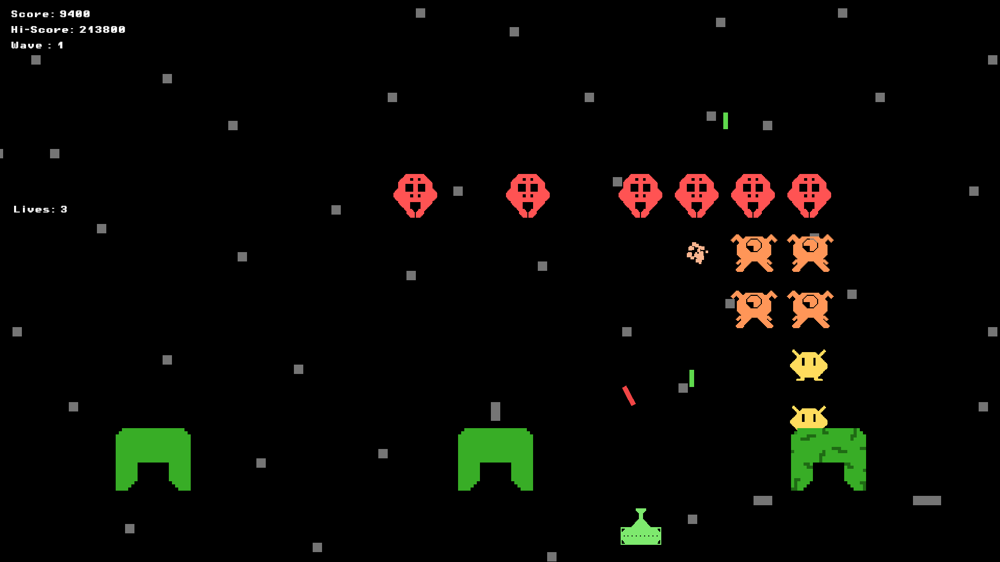
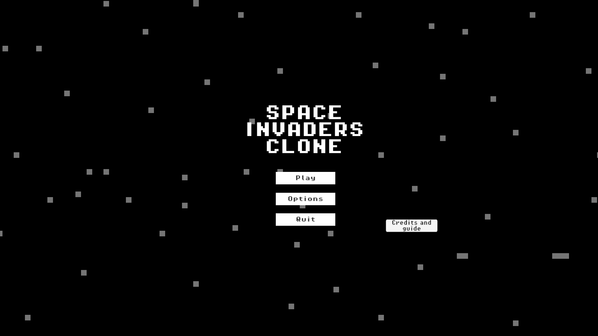
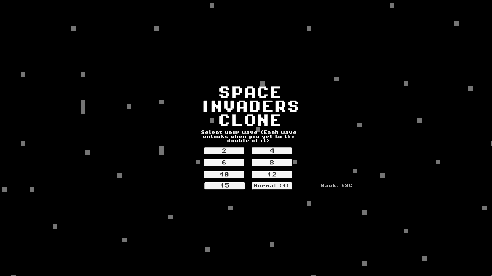
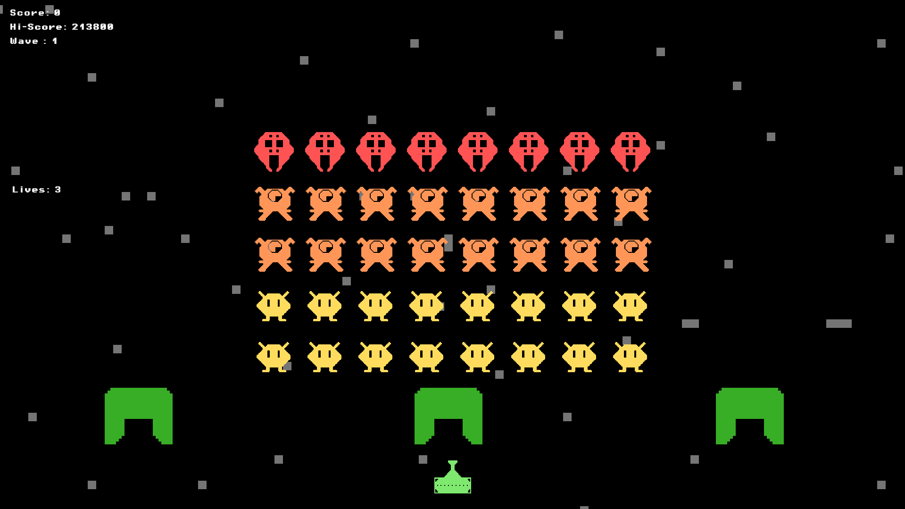
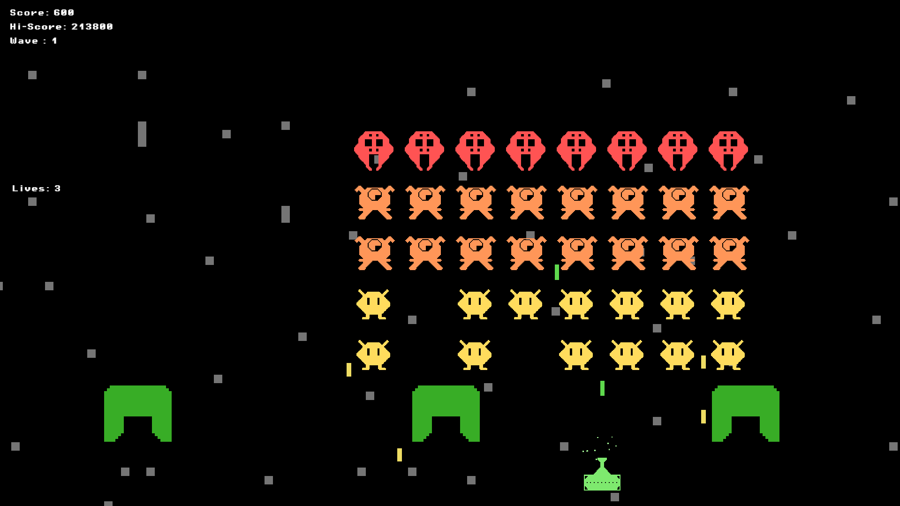

# Space Invaders Clone

## About the project
As the name suggests, this project is a clone of the popular retro game "Space Invaders". Shoot up aliens, dodge their deadly bullets and try to survive for as long as you can while gathering points and sending the aliens to where they belong, D E A T H.

## Features
- Main menu: SON... ALMOST EVERY GAME HAS THIS!!!! 😐🗿
- The main game: It's just space invaders with some tweaks.
- A wave selector: At the start of the game, you can choose which wave are you going to start on so that you don't have to always start from wave 1. however keep in mind that you have to unlock that wave first by reaching double of that said wave. <br>
<br>






## How to play?
1. Export all of the content of game.zip. (Make sure to export otherwise your high score and highest wave won't be saved)
2. Use the arrow keys to move the ship around.
3. Press the Space button to shoot.
4. If you want to pause, press Esc.
5. Dodge the alien bullets and try to kill all of them before they reach the bottom of the screen.
6. Use the Bunkers efficiently, you can also destroy them.
7. Manage your lives, pay attention to the sounds.
8. Have fun :)

## The Technical aspect
The entire game including all of the assets were made within the span of 15 days of the Iranian new year holiday. <br>
No AI was used for the pixel art, music, UI and sound effects as all of them were hand made. <br>

### The Tech stack
- Game engine used: Unity
- Pixel art and animations program: Aseprite
- Music and SFX: FL studio

### Project structure
The structure is messy but you can handle it.
Here's a brief description for some of the main ```.cs``` files within the project:
- <b>BackGroundManager.cs: </b> This manages the background scrolling as well as randomizing with BG should show up next.
- <b>WaveManager.cs: </b> This script is responsible for checking if the current wave is finished. if yes then advance to the next wave and activate certain events such as score handling, bunker handling and possibly giving an extra life. the script is also responsible for handling bunkers after certain amount of waves.
- <b>WaveSetter.cs: </b> This script is responsible for activating the very first wave when you transition from main menu to the main game.
- <b>Wave.cs: </b> This is the main wave entity. this script handles spawning the enemies of each wave, handling their speed, handling their difficulty, aggression and movement. Since every enemy is attached to the gameObject that owns this script, their movement is tied to this gameObject's.
- <b>Enemy.cs: </b> This is the Parent class for all enemies. every enemy/destroyable thing inherits this script.

## How can i contribute?
Feel free to fork the repository and add your own stuff to it :) <br>
Things that i suggest to add and why:
1. <b>A Power-up system: </b> This was initially one of the features that I was going to make but i got tired of this project and reached my deadline of before Uni's term 4 resumes again. The way that the power-up system works is that after killing each enemy, each enemy can drop a power up. the chance of each power up is random. some are more common than others. the power-ups that i had in mind are as follows: Screen Nuke (super rare), Shotgun weapon, movement speed boost, piercing weapon, temporal shield, shooting speed boost.
2. <b>Improved UI and graphics: </b> While i did try my best to make the graphics as simple and fun as possibly, i cannot deny that the game does not have as much soul and charm as i wished. that's because I'm a music composer and programmer more than artist and animator. you if you can improve the UI and graphics, it would be amazing!
3. <b>Improved Logo: </b> The logo was going to have small version of all 3 alien types sprinkled around it's text but i got too lazy and never made it. i believe the mini-version of the aliens is somewhere in the files.
4. <b>Improved sound design: </b> The game's sound design and specially sound mixing is pretty messy. the sound effects are fine but in case they are not, feel free to change them. aside from pitch and volume shifting, no other audio manipulation was done.
5. <b>More features: </b> this game is the bare minimum version of space invaders with some super small tweaks. This project can be your canvas. so take your brush and turn this project B I G G E R.

## Credits
Programming, Design, Pixel Art, Animation, Music, SFX, Testing, Direction and Planning: MohammadAmin "Bamdad" Rashidi. <br>
Shoutouts to GapGPT, that thing was a savior during the massive internet blackout.
